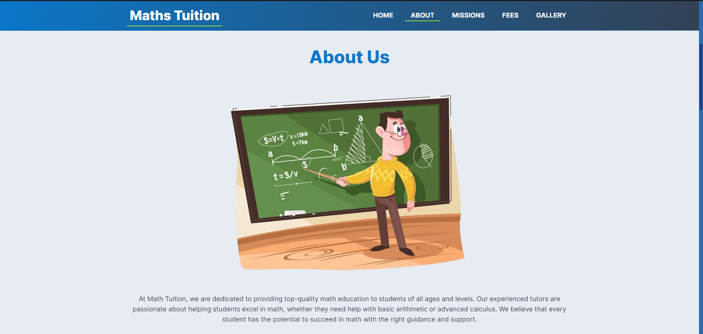

## 📚 Math Tuition - Top-Quality Math Education

Welcome to the **Math Tuition** project! 🚀 This website is dedicated to providing high-quality math education for students of all ages and levels. Our experienced tutors are here to help you excel in math, making learning fun and interactive! 🎉

## 🌟 Features

- **Personalized Learning**: Tailored tutoring plans to meet individual student needs.
- **Experienced Tutors**: Learn from passionate educators committed to your success.
- **Interactive Learning**: Engage in fun and challenging math exercises.
- **Gallery**: View photos of our learning environment and success stories.
- **Easy Navigation**: User-friendly interface to access all resources effortlessly.

## 📦 Getting Started

To get a local copy up and running, follow these steps:

### Prerequisites

- Node.js (version 14 or higher)
- npm (version 6 or higher)

### Installation

1. Clone the repository:

   ```bash
   git clone https://github.com/kabirjaipal/math-tuition-website.git
   ```

2. Navigate to the project directory:

   ```bash
   cd math-tuition-website
   ```

3. Install dependencies:

   ```bash
   npm install
   ```

4. Run the development server:

   ```bash
   npm run dev
   ```

5. Open your browser and visit `http://localhost:3000` to see the project in action! 🎈

## 📸 Screenshots





## 📖 Built With

- [Next.js](https://nextjs.org/) - React framework for building server-rendered applications
- [Tailwind CSS](https://tailwindcss.com/) - A utility-first CSS framework for rapid UI development
- [React Icons](https://react-icons.github.io/react-icons/) - Beautiful icons for React projects

## 🤝 Contributing

Contributions are welcome! If you have suggestions or improvements, please open an issue or submit a pull request. 🛠️

1. Fork the repo
2. Create your feature branch:
   ```bash
   git checkout -b feature/AmazingFeature
   ```
3. Commit your changes:
   ```bash
   git commit -m 'Add some AmazingFeature'
   ```
4. Push to the branch:
   ```bash
   git push origin feature/AmazingFeature
   ```
5. Open a pull request! 🎉

## 📝 License

This project is licensed under the MIT License - see the [LICENSE.md](LICENSE.md) file for details.

## 📬 Contact

For inquiries, please reach out to:

- **Email**: info@mathtuition.com
- **Twitter**: [@MathTuition](https://twitter.com/MathTuition)

Thank you for checking out **Math Tuition**! Let's make math fun together! 🎉
